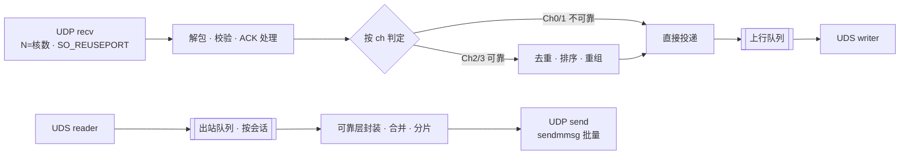
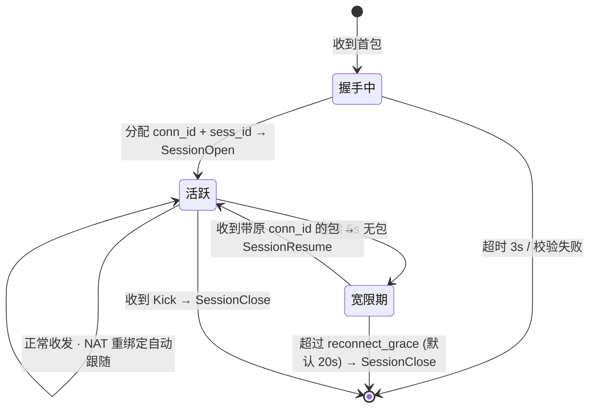

# T0002 soup-engine · 通用游戏服务器框架 技术规格书（Rust）

> 定位符：`T0002M{模块}F{功能}`
> 语言：Rust (edition 2021+) / 运行时：tokio / 对客户端：UDP / 对逻辑服：UDS（可选 shm）
> 配套：`T0003SoupSDKGo`（Go SDK）· `T0001SoupOut`（本游戏协议，待出）

## Version History

| 版本 | 变更 |
|---|---|
| v0.1 | 首版。架构定为 **Rust 通用框架 + Go 逻辑服**，双进程，零 cgo |

---

# M01 定位与职责边界

## T0002M01F01 一句话

> **soup-engine 是一个与具体游戏无关的实时对战服务器框架。Go 逻辑服通过 SDK 调用它，只写游戏规则，不碰任何网络细节。**

它把「做一个能扛住移动网络的实时对战服务器」这件事里**所有与游戏内容无关的部分**全部吃掉：UDP 传输、可靠层、通道语义、会话、断线重连、NAT 漂移、组播、背压、限流、抗攻击、可观测性。

**换一个游戏，这一整套原样复用。** 这是它作为独立技术产出的价值所在。

## T0002M01F02 整体架构

```
   移动客户端 (Godot)            通用框架                  本游戏逻辑
  ┌──────────────┐   UDP    ┌────────────────┐  UDS   ┌──────────────┐
  │ 输入 / 预测   │ ◀──────▶ │  soup-engine   │ ◀────▶ │  Go 服务端    │
  │ 插值 / 渲染   │  不可靠   │  (Rust)        │  可靠   │ + soup-sdk-go│
  └──────────────┘  高抖动   │                │  低延迟 │              │
                            │ UDP / 可靠层    │        │ 房间 / tick   │
                            │ 四通道 / 分片    │        │ 状态 / 规则   │
                            │ 会话 / 重连     │        │ 编解码        │
                            │ 组播 / 限流     │        │              │
                            │ 抗攻击 / 观测    │        │              │
                            └────────────────┘        └──────────────┘
                             通用 · 可复用              本游戏专有
```

## T0002M01F03 职责边界

| 归框架（Rust） | 归逻辑服（Go） |
|---|---|
| UDP 收发、可靠层、ACK、分片重组 | 房间状态与游戏规则 |
| 四通道语义与重传策略 | tick 循环与推进 |
| 会话生命周期、断线重连、NAT 漂移 | 输入抖动缓冲 |
| 组播、逐会话带宽限流、背压 | 快照编码与 baseline 选择 |
| 握手、HMAC、抗放大/洪泛、Fuzz 韧性 | 命中判定、数值结算 |
| 指标、追踪、压测工具 | 与客户端的业务协议内容 |

### 为什么 tick / 抖动缓冲 / baseline 不在 Rust 侧

不是切小了框架，是**这三件事在物理上必须和状态待在一起**：

- **tick**：游戏状态在 Go 的堆上。tick 放 Rust 就得每 tick 跨进程往返一次去驱动 Go，等于把两个进程重新焊死——恰好抵消掉「Rust 从不阻塞等 Go」这个我们选双进程的理由
- **baseline 选择**：只有拿得到状态的一侧才知道「相对 tick N 的增量」怎么算
- **抖动缓冲**：交付时机必须对齐 tick 边界，而 tick 在 Go

框架反过来提供这三件事所需要的**原料**：`SessionStats`（RTT/丢包，用于定抖动缓冲深度）、`Overload`（过载信号，用于降频）、`SetBudget`（带宽上限回落）。

## T0002M01F04 不可违反的约束

| 约束 | 说明 |
|---|---|
| **框架不持有游戏状态** | 只有会话表与传输层状态。框架重启后客户端重连即可恢复，对局数据不在这里 |
| **框架不解释 payload** | 只看 `channel` 决定可靠性策略；`msg_id` 仅用于统计分桶。**payload 里是什么，框架永远不问** |
| **框架不做鉴权决策** | token 原样透传给逻辑服，由逻辑服决定接受或踢出 |
| **框架不做匹配与房间分配** | 框架只认「会话」。房间概念在 Go 侧 |
| **框架永不阻塞等逻辑服** | 逻辑服慢或挂了，按 `M04F05` 丢包降级，绝不排队到内存爆炸 |
| **零游戏依赖** | CI 检查：`cargo tree -p soup-engine` 输出中不得出现任何业务 crate |

---

# M02 架构与线程模型



| 项 | 方案 |
|---|---|
| Socket | `SO_REUSEPORT` 多 socket，每核一个 recv task，内核负载均衡 |
| 批量收发 | `recvmmsg` / `sendmmsg`（Linux），单次系统调用处理 ≥32 个包 |
| 会话表 | 按 `conn_id` 高位分片的哈希表，每片单线程独占，**无锁** |
| 与逻辑服 | 单条 UDS 连接 + 双向帧流，每方向一个专用 task |
| 缓冲 | 全局 `BufferPool`，分级（256B / 1500B / 16KB），用完归还 |

---

# M03 客户端协议（UDP）

## T0002M03F01 数据报格式

```
UDP Datagram（MTU 上限 1200 字节）
┌──────────────────────────────────────────────────────┐
│ magic     u16   0x5A50                                │
│ version   u8                                          │
│ flags     u8    bit0=分片 bit1=纯ACK bit2=握手 bit3=加密│
│ conn_id   u32   会话标识（NAT 重绑定后仍可续接）         │
│ seq       u16   本端发送序号                            │
│ ack       u16   已收到的对端最大序号                     │
│ ack_bits  u32   ack 之前 32 个包的收到位图               │
├──────────────────────────────────────────────────────┤
│ 连续 N 个 Message Frame：                              │
│   hdr     u16   ch 占高 4 位 · msg_id 占低 12 位（小端） │
│   len     u16   body 长度                              │
│   body    [u8; len]                                   │
└──────────────────────────────────────────────────────┘
```

> **位序约定（v0.1.1 补）**：`ch` 与 `msg_id` 打包进同一个 `u16`，`ch` 在**高 4 位**、`msg_id` 在低 12 位，小端写入。实现侧（Rust E1 / Go mockengine）必须一致，否则联调错位。

**同一 datagram 内合并多条消息**，摊薄包头与系统调用开销。

## T0002M03F02 四条通道

| Ch | 语义 | 典型用途 | 丢失处理 |
|---|---|---|---|
| 0 | Unreliable Unordered | 快照下行 | 丢了就丢，下一帧覆盖 |
| 1 | Unreliable **Sequenced** | 客户端输入上行 | 只保留 seq 更大的，旧包直接丢弃 |
| 2 | Reliable Ordered | 开局 / 结算 / 房间事件 | 超时重传，按序交付 |
| 3 | Reliable Unordered | 一次性通知 | 超时重传，立即交付 |

## T0002M03F03 可靠层

- RTO = `SRTT + 4×RTTVAR`，夹在 [50ms, 1000ms]（Jacobson/Karels）
- 重传队列上限 64 条/通道，溢出即断连
- **仅 Ch2 支持分片重组**。Ch0/1 单包超 MTU 视为编码错误，丢弃并计数（编码方自行切分）
- 心跳 1Hz；连续 5s 无包进入重连宽限期
- `conn_id` 让会话独立于 `IP:Port` —— **手机切 WiFi / 蜂窝不掉线**

## T0002M03F04 加密（v2，先留位）

握手用 X25519 交换密钥，数据用 ChaCha20-Poly1305 逐包加密。v1 先留 `flags.bit3` 占位，明文跑通。

---

# M04 框架 ↔ 逻辑服协议

## T0002M04F01 传输选型

| 阶段 | 方案 | 理由 |
|---|---|---|
| **v1（必做）** | Unix Domain Socket，`SOCK_STREAM` + 长度前缀分帧 | 简单可靠，Go 侧零依赖，可用 `socat` 直接抓包调试 |
| v2（优化） | 双向 SPSC 共享内存环形缓冲 | 单向 ~50µs → ~10µs。**只在压测证明 UDS 是瓶颈时才做** |

对 50ms 的 tick 预算而言，UDS 这一跳完全可忽略。**不要一上来就写 shm。**

## T0002M04F02 帧格式

```
┌────────────────────────────────────┐
│ len   u32   后续字节数（不含本字段）    │
│ type  u8    消息类型                 │
│ body  [u8]                          │
└────────────────────────────────────┘
```

## T0002M04F03 框架 → 逻辑服

| type | 名称 | body | 说明 |
|---|---|---|---|
| `0x01` | `SessionOpen` | `sess_id u64` · `addr [u8;18]` · `token_len u16` · `token[]` | 握手完成。**token 原样透传，框架不校验** |
| `0x02` | `SessionClose` | `sess_id u64` · `reason u8` | 超过重连宽限期，或被踢 |
| `0x03` | `SessionResume` | `sess_id u64` · `gap_ms u32` | 重连成功。**逻辑服应据此推全量状态，而非当新玩家处理** |
| `0x10` | `Data` | `sess_id u64` · `ch u8` · `msg_id u16` · `payload[]` | 一条已解可靠层的业务消息 |
| `0x20` | `SessionStats` | `sess_id u64` · `rtt_ms u16` · `loss_permille u16` · `out_kbps u16` | 每秒一次。逻辑服据此定抖动缓冲深度与快照频率 |
| `0x2F` | `Overload` | `dropped_up u32` · `dropped_down u32` | 框架正在丢包，逻辑服应降频自保 |
| `0x30` | `EngineHello` | `version u16` · `caps u32` | 连接建立首帧 |

## T0002M04F04 逻辑服 → 框架

| type | 名称 | body | 说明 |
|---|---|---|---|
| `0x81` | `Send` | `sess_id u64` · `ch u8` · `msg_id u16` · `payload[]` | 发给单个会话 |
| `0x82` | `Multicast` | `n u8` · `sess_id[n] u64` · `ch u8` · `msg_id u16` · `payload[]` | **一份 payload 发多人**，框架侧只拷贝一次 |
| `0x83` | `Kick` | `sess_id u64` · `reason u8` | 鉴权失败或作弊，框架立即断连 |
| `0x84` | `SetBudget` | `sess_id u64` · `kbps u16` | 逐会话带宽上限，框架侧限流 |
| `0x90` | `LogicHello` | `version u16` · `caps u32` | 连接建立首帧 |

> `Multicast` 是必须的。房间广播事件若逐人 `Send`，同一份 payload 要过 N 次 IPC。快照因各人 baseline 不同，仍走 `Send`。

## T0002M04F05 背压与降级

| 方向 | 队列满时 |
|---|---|
| 框架 → 逻辑服 | **丢弃 Ch0/Ch1（不可靠），保留 Ch2/Ch3**，发 `Overload` 通知。⛔ 绝不阻塞 recv task |
| 逻辑服 → 框架 | UDS 写阻塞会反压到 Go 侧。**逻辑服必须自己限流**（见 `T0003M07`），不能指望框架兜底 |

## T0002M04F06 逻辑服掉线

框架**保持所有客户端会话不断开**，缓存上行到有界队列，并继续给客户端发心跳。逻辑服重连后：

1. 框架重发 `EngineHello`
2. 对每个存活会话补发 `SessionResume`（`gap_ms` = 中断时长）
3. 逻辑服据此推全量状态

**结论：逻辑服可以热重启，玩家不掉线。** 这是双进程架构白送的运维能力，别浪费。

---

# M05 会话生命周期



**关键点：宽限期内框架不发 `SessionClose`。** 逻辑服此时不应把玩家当离开处理——短暂断网在移动网络下是常态。

---

# M06 性能

## T0002M06F01 目标值

> ⚠️ 以下全部是**待压测验证的目标**，不是已测事实，也不是对外承诺。跑完 `M08F03` 后回填实测。

| 指标 | 目标 |
|---|---|
| 单核转发吞吐 | ≥ 200k pkt/s |
| 框架内延迟（收包 → 投递逻辑服） | p99 < 200 µs |
| 框架内延迟（逻辑服帧 → UDP 发出） | p99 < 200 µs |
| **稳态堆分配** | **0 次/包**（`dhat` 或计数 allocator 验证） |
| 单会话内存 | < 8 KB（含重传队列） |
| 并发会话 | ≥ 20,000 / 4C8G |

## T0002M06F02 零分配落地手段

- 所有缓冲来自 `BufferPool`，分级复用，用完归还
- 会话表、重传队列、ack 位图在会话建立时**预分配**
- 热路径禁止 `format!` / `String` / `Box<dyn>`；日志走 `tracing` 惰性求值
- `recvmmsg` / `sendmmsg` 的 iovec 数组复用

---

# M07 安全与健壮性

| 威胁 | 应对 |
|---|---|
| 伪造 `conn_id` 劫持会话 | 握手下发 64 位随机 `session_secret`，每包带 4 字节截断 HMAC |
| 放大攻击（伪造源 IP） | 握手三次交换；**未完成握手前，回包不得大于收包** |
| 洪泛 / 半开连接耗尽 | 未握手会话独立配额 + 每 IP 速率限制 |
| 畸形包 | 所有解析走边界检查。**任何输入都不得 panic** —— fuzz 是硬性要求 |
| 单会话刷流量 | 逐会话上行速率限制，超限计数并可自动 Kick |
| 逻辑服被拖垮 | `M04F05` 背压 + `Overload` 通知 |

---

# M08 可观测性与测试

## T0002M08F01 指标

`sessions_active` · `sessions_handshaking` · `pkt_in/out_per_sec` · `bytes_in/out_per_sec` · `rtt_{p50,p99}` · `loss_rate` · `retransmit_rate` · `engine_latency_{p50,p99}` · `logic_queue_depth` · `dropped_{up,down}` · `alloc_per_sec` · `nat_rebind_count`

## T0002M08F02 测试要求

| 类型 | 要求 |
|---|---|
| **Fuzz** | `cargo-fuzz` 跑包解析器。**任何字节序列都不得 panic**。CI 每次 5 分钟，夜间 1 小时 |
| 网络模拟 | 可注入：固定延迟 / 抖动 / 丢包率 / 乱序 / 重复 / 突发全丢 |

| 集成场景 | 期望 |
|---|---|
| 150ms 延迟 + 5% 丢包 | Ch2 不丢不乱序；Ch0/1 正常降级 |
| 突发 2s 全丢 | 恢复后自动补齐，会话不断 |
| 断连 10s 后重连 | 发 `SessionResume`，逻辑服未收到 `SessionClose` |
| NAT 重绑定（IP:Port 变化） | 凭 `conn_id` + HMAC 无缝续接 |
| **逻辑服 `kill -9` 后重启** | **客户端全程不掉线**，重启后收到全部 `SessionResume` |
| 恶意包（超长 / 伪造 seq / 垃圾字节） | 拒绝并计数，不 panic，不影响其他会话 |

## T0002M08F03 压测

`engineload` 工具：模拟 N 个客户端 × 指定 pps，输出吞吐、延迟分布、CPU、内存、分配次数。用于回填 `M06F01`。

---

# M09 里程碑

| 里程碑 | 内容 | 出口标准 |
|---|---|---|
| **E1 骨架** | UDP 收发、包格式、握手、会话表、UDS 帧流 | Go 侧能 echo 一条消息回客户端 |
| **E2 可靠层** | seq/ack/ackbits、四通道、重传、分片重组、心跳 | 网络模拟 150ms + 5% 丢包下 Ch2 不丢不乱 |
| **E3 韧性** | 重连宽限期、NAT 漂移、背压、`Overload`、逻辑服热重启 | `M08F02` 集成场景全过 |
| **E4 硬化** | fuzz、HMAC、限流、metrics、`engineload` | `M06F01` 全部回填实测 |

**E1 完成即可与 Go 侧联调。** E2/E3 可以在游戏逻辑开发的同时并行补齐。

---

# M10 需要游戏侧提供的东西

框架不需要知道游戏内容。联调只需三项，由 `T0001SoupOut` 给出：

1. 各 `msg_id` 走哪条 `channel`
2. 单会话带宽预算（用于 `SetBudget`）
3. `reconnect_grace` 取值

**这三项冻结之前，E1/E2 完全可以先行开发** —— 它们不依赖任何协议内容。
