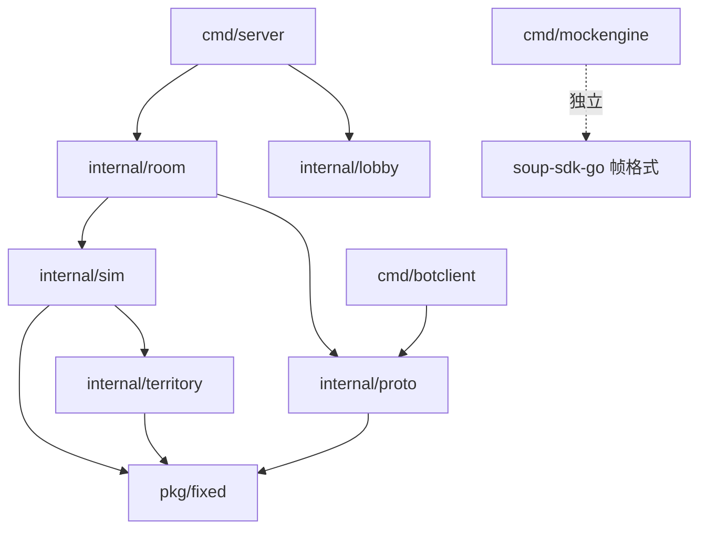

# T0004 soupout-server · Go 逻辑服 实现架构文档

> 定位符：`T0004M{模块}F{功能}`
> 上位：`G0001SoupOut`（玩法）· `T0001SoupOut`（协议冻结）
> 依赖：`T0003SoupSDKGo`（SDK 契约）· `T0002SoupEngine`（Rust 框架，可用 mock 替代）

## Version History

| 版本 | 变更 |
|---|---|
| v0.1 | 首版。包结构、模块规格、tick 执行顺序、开发顺序与验收 |

---

# M01 范围

## T0004M01F01 本文覆盖什么

Go 侧要写的**全部代码**：游戏逻辑、协议编解码、大厅、以及为了不等 Rust 而必须先做的 mock 框架和假客户端。

## T0004M01F02 并行开发的前提：先写 mock engine

> **Go 侧不等 Rust。**

`cmd/mockengine` 按 `T0002M04` 的 UDS 帧格式实现一个假框架：开 UDP socket、**不做**可靠层/重连/NAT/加密，收到包原样转成 `Data` 帧交给 SDK，反向亦然。约 200 行。

由此：Godot 能连、逻辑能跑、全部玩法开发不阻塞。Rust 的 E1 好了之后**换一行 socket 地址配置**即可切真框架。

**只有验证「丢包 / 重连 / NAT 漂移 / 抗攻击」韧性时才需要真框架。**

---

# M02 包结构与依赖

```
soupout-server/
├── cmd/
│   ├── server/          main：装配 SDK + Gatekeeper + Room
│   ├── mockengine/      假框架（见 M01F02）
│   └── botclient/       headless 假客户端，自动化对局与压测
├── internal/
│   ├── territory/       96×96 网格 · 增量测地膨胀 · 面积统计 · 增量导出
│   ├── sim/             移动 · 战斗 · 死亡复活 · 板子翻窗 · 道具 · 质量派生
│   ├── proto/           T0001M02 全部消息的编解码
│   ├── lobby/           Gatekeeper：房间码池 · 快速匹配队列
│   └── room/            Room 接口实现：粘合 sim + territory + proto
├── pkg/
│   └── fixed/           定点数（Q22.10）
└── testdata/replays/    确定性回放录像
```

**依赖方向（不得反向）**



| 规则 | 说明 |
|---|---|
| `territory` 不 import 任何本项目其他包（除 `fixed`） | 它必须能独立测试、独立可视化 |
| `sim` 不 import `proto` | 模拟层不知道网络协议长什么样 |
| `proto` 不 import `sim` | 编解码只认字节和基础类型；`room` 负责搬运 |
| `room` 是唯一的粘合层 | 它 import 上面所有 |

---

# M03 模块规格

## T0004M03F01 `territory` 【全项目最难，第一个做】

### 数据结构

```go
type Cell uint16   // y*96 + x，值域 0..9215

type Field struct {
    w, h     int
    owner    []uint8       // 9216：0=原汤 1..4=玩家 15=锅外
    dist     []uint16      // 9216：该格到其所有者源的测地距离（Chamfer 单位）
    frontier [4]minHeap    // 每玩家的扩张前沿（小顶堆）
    claimed  [4]maxHeap    // 每玩家已占格按 dist 排序（流失时从最外层退）
    blocked  [4][]Cell     // 本 tick 被僵持挡住的格，下 tick 重入 frontier
    R        [4]fixed.F    // 每玩家扩张半径
    area     [5]int32      // 各归属的格数（含原汤）
    log      changeRing    // 变更环形日志，供 DiffSince
}
```

### 距离度量

**Chamfer 距离（整数，确定性）**：正交邻居 `+8`，对角邻居 `+11`（≈ 8√2）。
用整数避免浮点跨平台不一致；`dist` 用 `uint16`，上限 8191 格，远超 96 网格所需。

### 核心 API

```go
func New(w, h int, pot Circle) *Field
func (f *Field) Seed(owner uint8, center Cell, targetArea int)  // 开局 10%
func (f *Field) Step(charging [4]bool, rate fixed.F, tick uint32)
func (f *Field) Dissolve(owner uint8, rate fixed.F, tick uint32)
func (f *Field) Ratios() [4]uint16                              // 万分比
func (f *Field) DiffSince(sinceTick uint32, out *[]Change) bool // false=需关键帧
func (f *Field) EncodeRLE(out *proto.Buffer)                    // 关键帧
func (f *Field) Hash() uint64                                   // 确定性校验
```

### 膨胀算法（对应 `T0001M03F03`）

```
Step(charging, rate, tick):
  for p in 1..4 where charging[p]:
      frontier[p].pushAll(blocked[p]); blocked[p] = blocked[p][:0]
      R[p] += rate
      for frontier[p].top().dist <= R[p]:
          c = frontier[p].pop()
          switch owner[c]:
          case 锅外/障碍:  continue                    // 丢弃
          case p:          continue                    // 已是自己的
          case 原汤:       claim(p, c, tick)
          case 敌方 q:
              if charging[q]: blocked[p].append(c)     // 僵持
              else:           claim(p, c, tick)        // 抢占
          for nb in 八邻(c):
              if owner[nb] != p && !inFrontier(nb):
                  cost = (正交 ? 8 : 11)
                  if owner[nb] 是敌方: cost += stealPenalty   // 抢地比开荒慢
                  frontier[p].push(dist[c] + cost, nb)
```

**堆元素打包为 `uint32 = dist<<16 | cell`**：一次比较同时按 `dist` 再按 `cell` 排序，**平局顺序确定**，满足 `T0003M06` 的确定性要求。

**流失（`Dissolve`）** 是对称操作：`R[p]` 下降，从 `claimed[p]` 的**最大 dist** 端弹出并归还原汤。

**为什么不会突发**：单 tick 翻转数 ≈ `周长 × ΔR / 格宽`，`R` 连续增长 ⇒ 翻转数连续。实测中段约 4 格/tick/人（`T0001M03F03` 已推导）。

### 变更日志与增量导出

```go
type Change struct{ Tick uint32; Cell Cell; Owner uint8 }
type changeRing struct{ buf []Change; head int }   // 容量 4096 ≈ 40s 历史
```

`DiffSince(t)`：从环尾向前走到 `Tick <= t` 为止，用一个复用的 **9216 位 bitset** 去重（同一格取最新），零分配。
若 `t` 早于环内最老记录 → 返回 `false`，调用方改推关键帧。

> ⛔ **不要用「全格扫描 version 数组」实现 DiffSince。** 9216 × 4 客户端 × 10Hz × 数百房间 = 内存带宽灾难。环形日志的开销只跟实际变更数成正比。

### 验收

| # | 标准 |
|---|---|
| T1 | `Seed` 后各人面积 = 10% ± 1% |
| T2 | 单人持续充能，面积随时间**单调平滑**增长，任意 tick 翻转数 ≤ 32 |
| T3 | 两人同时向同一边界充能 → 边界**静止不动**（`G0001M02F03`） |
| T4 | 一人充能一人不充 → 边界稳定推进，速率低于开荒（`stealPenalty` 生效） |
| T5 | `Dissolve` 从最外层开始退，形状不出现空洞 |
| T6 | 同 seed 同输入序列跑两遍，`Hash()` 完全一致 |
| T7 | `Step` + `DiffSince` 稳态 **0 次堆分配**（`testing.AllocsPerRun`） |
| T8 | 提供 ASCII / PNG 可视化测试，肉眼可验膨胀形态 |

> **这个包跑通，项目最大的技术风险就过去了。它不依赖网络、不依赖 SDK，现在就能开工。**

## T0004M03F02 `sim`

```go
type World struct {
    tick     uint32
    players  [4]Player      // 定长数组，非 slice，无分配
    field    *territory.Field
    pallets  []Pallet       // 建房时预分配
    vaults   []Vault
    drops    [8]Drop
    events   []Event        // 复用切片，每 tick 清空重填
    rng      *DetRand
    cfg      *Config        // 所有 KNOB
}

type Player struct {
    id            uint8
    pos, vel      fixed.Vec2
    aim           uint16
    hp            fixed.F
    mass          fixed.F      // 由 field.area 派生
    input         Input        // 预分配，OnInput 解码进这里
    state         StateFlags
    vaultUntil    uint32
    attackUntil   uint32
    respawnAt     uint32
    deathCount    uint8
    kills         uint8
}
```

职责：移动与碰撞、质量派生属性、攻击判定、死亡与复活、板子与翻窗交互、道具刷新与 buff、结算判定。
**不碰网络、不碰协议。**

## T0004M03F03 `proto`

`T0001M02` 全部消息的 `Encode*` / `Decode*`。全部小端、全部写进调用方给的 `*Buffer`（`T0003M02F04`）。

| 约束 | 说明 |
|---|---|
| 解码不分配 | `Decode*` 写进调用方传入的结构指针，不 `new`、不 `append` |
| 长度校验先行 | 任何长度不符立即返回错误，**不得 panic**（`T0001M08`） |
| 与 Godot 手写对齐 | 消息不多，两边手写。**`T0001M02` 是唯一真相**，改了两边同步改，不上 codegen |

## T0004M03F04 `lobby`

实现 SDK 的 `Gatekeeper`。全内存，无数据库。

```go
type Lobby struct {
    rooms      map[RoomCode]*RoomHandle
    codePool   *codePool      // 4 位 A-Z0-9，去掉 0/O/1/I/L；销毁后冷却 60s 复用
    quickQueue []PlayerID     // FIFO，凑满 4 人开局
    nextPID    uint32
}
```

三个方法：`Authenticate`（匿名，收 nickname 发 playerId）· `Route`（查房间码 / 进匹配队列）· `NewRoom`（建房并播种 seed）。

> 这些 map 在**房间外**，不参与 tick，不受 `T0003M06` 的「不得遍历 map」约束。

## T0004M03F05 `room` —— 实现 SDK 的 `Room` 接口

粘合层。**`Tick` 内的执行顺序是本模块最重要的契约**，见 `M04`。

| 方法 | 实现要点 |
|---|---|
| `OnJoin` | `sim` 初始化玩家；`field.Seed` 给 10% 地盘 |
| `OnLeave` | 标记该玩家为流失状态（地盘按死亡规则化汤，`T0001M07`） |
| `OnResume` | 清"离线中"标记。SDK 已自动推过全量，此处无需推送 |
| `OnInput` | `proto.DecodePlayerInput` → 写进 `player.input`。⚠️ **不得持有 payload 切片** |
| `Tick` | 见 `M04` |
| `EncodeSnapshot` | `0x0C0` + `0x0C1`（`field.DiffSince` 返回 false 时改走关键帧） |
| `EncodeFullState` | `0x042` + `0x0C3`（`field.EncodeRLE`） |
| `StateHash` | `sim` 状态 + `field.Hash()` |

## T0004M03F06 `cmd/mockengine` 与 `cmd/botclient`

| 工具 | 用途 |
|---|---|
| `mockengine` | 见 `M01F02`。**并行开发的前提，第一周必须有** |
| `botclient` | headless 客户端：连服、随机/脚本化输入、打完整局。用于自动化回归、压测、平衡数据采集。**没有它，每次改动都要 4 个真人开手机验** |

---

# M04 Tick 执行顺序 【契约】

> 顺序错了会产生难以定位的因果 bug。**改动顺序需要更新本节。**

```
Tick(t):
  1. 复活         respawnAt <= t 的玩家复活（位置 = 己方地盘质心）
  2. 移动         按 input + 当前质量派生的移速积分位置；锅沿/倒下的板子碰撞
  3. 交互         翻窗开始/结束（按质量决定耗时）、推板子
  4. 扩张         territory.Step(charging, expandRate, t)
                  charging[p] = input.buttons.bit1 && 不在攻击前摇 && 不在翻窗 && 站在自己地盘上
  5. 流失         对死亡/掉线玩家 territory.Dissolve()
  6. 战斗         结算本 tick 到期的攻击前摇 → 命中判定 → 扣质量 → 死亡判定
  7. 道具         刷新、拾取、buff 到期
  8. 质量重算     mass = f(field.area)；更新移速/攻防/过重阈值
  9. 结算判定     stewTicks 归零 或 某人 ≥65% → End
 10. 事件出队     events → ctx.BeginBroadcast/Commit
```

**两条容易踩的**：

- **第 6 步用的是第 8 步「上一 tick」算出的质量派生属性。** 战斗和面积变化在同一 tick 内不互相影响，避免因果环，也让回放更好定位。
- **第 4 步在第 2 步之后。** 膨胀源是玩家当前位置，位置必须先更新。

---

# M05 确定性与零分配落地

| 约束 | 落地手段 | 验证 |
|---|---|---|
| 不得遍历 map | 房间内一律用定长数组 / slice；`golangci-lint` 自定义规则拦截 | lint |
| 不得起 goroutine | 房间逻辑内禁止 `go` 语句 | lint |
| 不得用 `time.Now` / `math/rand` | 只用 `ctx.Rand()`；import 白名单 | lint |
| 浮点 | **全线定点 `pkg/fixed`（Q22.10）**，`sim` 与 `territory` 内不出现 `float32/64` | lint |
| 零分配 | 预分配数组、复用 `events` 切片、bitset 复用、`Buffer` 走池 | `testing.AllocsPerRun == 0`，进 CI |
| 堆平局顺序 | 元素打包为 `uint32 = dist<<16 \| cell` | T6 回放测试 |

---

# M06 测试策略

| 层级 | 内容 |
|---|---|
| 单元 | `territory` 的 T1–T8；`proto` 往返编解码；`fixed` 运算 |
| 属性测试 | 随机输入序列跑 `territory`，断言面积单调性、无空洞、总面积守恒 |
| **确定性回放** | 录 `(seed, cfg, inputs)`，重放比对 `StateHash()`。**线上任何异常都必须能靠录像本地复现** |
| 集成 | 4 个 `botclient` 打完整局，断言正常结算、无 panic、tick 不超预算 |
| 分配断言 | `Tick` + `EncodeSnapshot` 0 次分配，进 CI |
| 竞态 | `-race` 全量，房间状态不得跨 goroutine |

---

# M07 开发顺序与验收

| 周 | 内容 | 出口标准 |
|---|---|---|
| **W1** | `pkg/fixed` + **`internal/territory`** | `T1–T8` 全过，可视化测试能看到膨胀 |
| **W1–2** | `cmd/mockengine` + `soup-sdk-go` S1/S2 | **Pong 跑通**（`T0003M10`） |
| **W2–3** | `internal/proto` + `internal/sim` + `internal/room` + `internal/lobby` | 4 个 `botclient` 能打完整一局并正常结算 |
| **W3–4** | `soup-sdk-go` S3（抖动缓冲 / baseline / 关键帧 / 重连） | 模拟 150ms + 5% 丢包下对局正常；断连 10s 重连状态一致 |
| **W4+** | 切真 Rust 框架，联调 | `T0002M08F02` 集成场景全过 |

**关键路径是 `territory`。** 它不依赖任何其他东西，风险最高，所以第一个做、单独做、做透。

---

# M08 与其它文档的对应

| 本文模块 | 规格来源 |
|---|---|
| `territory` | `T0001M03`（网格、膨胀、边界对抗、增量编码） |
| `sim` | `G0001M02–M06`（扩张、质量、战斗、地形、道具） |
| `proto` | `T0001M02`（**冻结的字节布局**） |
| `lobby` | `T0001M06`（房间码、匹配、生命周期） |
| `room` | `T0003M02F02`（`Room` 接口签名） |
| `mockengine` | `T0002M04`（UDS 帧格式） |

---

# M09 待定

| 项 | 何时定 |
|---|---|
| `expandRate` 及全部 `KNOB_*` | P0 单机原型实测后 |
| `stealPenalty` | 与 `expandRate` 一起调 |
| `changeRing` 容量（暂定 4096） | 压测后按实际变更速率调整 |
| 网格是否从 96 提到 128 | 看平板上的边界颗粒度 |
| 是否需要 Bot 填人 | MVP 之后 |
